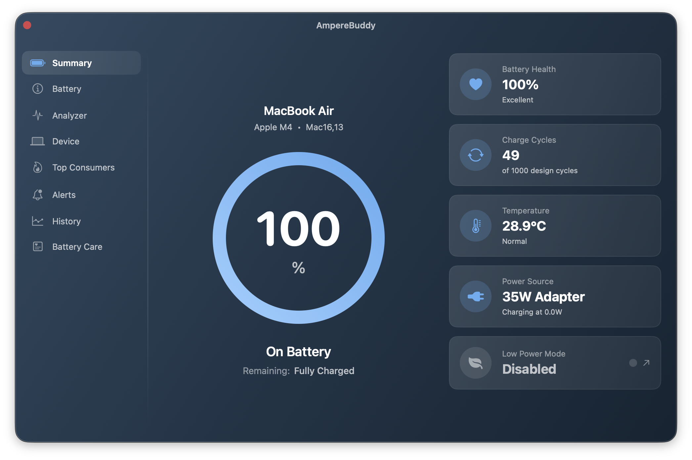
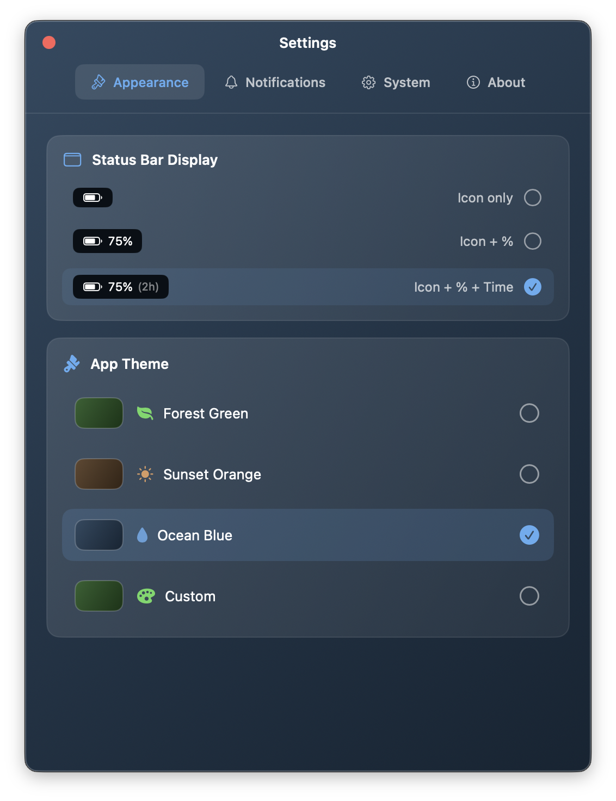

# AmpereBuddy

**Complete battery monitoring for your Mac**

AmpereBuddy is a lightweight, privacy-focused menu bar application that provides comprehensive battery health monitoring, historical tracking, and customizable alerts for Apple Silicon Macs.


---

## Screenshots

<p align="center">
  
</p>

<p align="center">
  
</p>

<p align="center">
  
</p>

---

## Table of Contents

- [Features](#features)
- [Installation](#installation)
- [Usage](#usage)
- [Privacy](#privacy)
- [Security](#security)
- [FAQ](#faq)
- [Uninstall](#uninstall)
- [Technical Details](#technical-details)
- [Troubleshooting](#troubleshooting)
- [Support](#support)
- [Credits](#credits)
- [Disclaimer](#disclaimer)
- [License](#license)

---

## Features

### Battery Monitoring
- Real-time battery charge percentage and health status
- Time remaining for discharge/charge
- Current, maximum, and design capacity (mAh)
- Cycle count with design cycle comparison
- Temperature, voltage, and amperage readings
- Individual cell voltage monitoring
- Charger/adapter details (wattage, type)

### System Information
- Mac model identification
- CPU cores (performance/efficiency breakdown)
- GPU and Neural Engine cores
- RAM and storage details
- macOS version and security status

### Alerts & Notifications
- Low battery warnings (20%)
- Fully charged notifications
- Critical battery alerts
- Charger connection events
- High temperature warnings
- Customizable sounds

### Battery History
- Weekly health snapshots
- Historical capacity tracking
- Cycle count progression
- Event log with filtering

### Customization
- 4 built-in themes + custom color picker
- 3 status bar display modes
- Launch at login option
- Configurable notifications and sounds

---

## Installation

### Requirements
- macOS 26.0 (Tahoe) or later
- Apple Silicon Mac (M1, M2, M3, M4 series)

### Download

#### Option 1: GitHub Releases (Recommended)
1. Go to [Releases](../../releases/latest)
2. Download `AmpereBuddy-X.X.X.dmg` from the latest release
3. Open the DMG file
4. Drag AmpereBuddy to your Applications folder
5. Launch AmpereBuddy from Applications

#### Option 2: Direct Download
Download the latest `.dmg` from [macfoundry.it/amperebuddy](https://macfoundry.it/amperebuddy)

### First Launch
On first launch, macOS may show a security prompt. Go to **System Settings > Privacy & Security** and click "Open Anyway" to allow the app.

---

## Usage

### Menu Bar
- **Left-click**: Open battery details popup
- **Right-click**: Open context menu (Open Battery Monitor, Quit)

### Main Window
Access the full Battery Monitor by right-clicking the menu bar icon and selecting "Open Battery Monitor".

### Settings
Click the gear icon in the popup or main window to access Settings:
- **Appearance**: Theme and status bar display options
- **Notifications**: Configure alerts and sounds
- **System**: Launch at login, update checks, data management
- **About**: App information and support

---

## Privacy

AmpereBuddy is designed with privacy as a core principle:

- **No telemetry or analytics** - We don't track how you use the app
- **No user accounts** - No registration or login required
- **No cloud sync** - All data stays on your Mac
- **No third-party services** - No external APIs except secure update checks
- **Local storage only** - Data stored in `~/Library/Application Support/AmpereBuddy/`

For full details, see [PRIVACY.md](PRIVACY.md).

### Data Stored Locally
- `battery_history.json` - Weekly battery health snapshots
- `alerts_log.json` - Event log (max 500 entries)
- `error.log` - Error logs for troubleshooting (max 100KB)
- User preferences in macOS UserDefaults

### Network Access
The app only connects to the internet for **optional** update checks:
- Endpoint: GitHub Releases API (falls back to `macfoundry.it` if needed)
- Secured with certificate pinning and Ed25519 signatures
- No user data is transmitted
- Can be disabled in Settings > System

---

## Security

AmpereBuddy implements multiple security measures:

- **Ed25519 signatures** - All updates are cryptographically signed
- **Certificate pinning** - Prevents man-in-the-middle attacks
- **SHA-256 verification** - Downloaded files are hash-verified
- **Minimal permissions** - Only IOKit access for battery data

For security policy and vulnerability reporting, see [SECURITY.md](SECURITY.md).

---

## FAQ

### Is AmpereBuddy free?
Yes, AmpereBuddy is completely free. You can optionally support development via [Buy Me a Coffee](https://buymeacoffee.com/panjakub).

### Does AmpereBuddy work on Intel Macs?
No, AmpereBuddy is designed exclusively for Apple Silicon Macs (M1, M2, M3, M4 series).

### Does AmpereBuddy work on desktop Macs?
Desktop Macs (Mac mini, Mac Studio, Mac Pro, iMac) don't have batteries. AmpereBuddy will show a friendly "No Battery Detected" message on these devices.

### Is my battery data sent anywhere?
No. All battery data stays on your Mac. The app never transmits battery information, usage data, or analytics to any server.

### Why does my battery health differ from Apple's?
AmpereBuddy reads data directly from macOS IOKit APIs. Apple may use different calculation methods in their diagnostics. For official battery service recommendations, consult Apple Support.

### Can I disable update checks?
Yes. Go to Settings > System and disable "Check for updates automatically".

### Does AmpereBuddy affect battery life?
No. AmpereBuddy uses efficient IOKit notifications and minimal polling. The app is designed to have negligible impact on battery life.

### Is AmpereBuddy affiliated with Apple?
No. AmpereBuddy is an independent third-party application, not affiliated with, endorsed by, or sponsored by Apple Inc.

---

## Uninstall

### Quick Uninstall
1. Quit AmpereBuddy (right-click menu bar icon > Quit)
2. Drag AmpereBuddy from Applications to Trash
3. Empty Trash

### Complete Uninstall (including data)
To remove all app data:

```bash
# Remove app data
rm -rf ~/Library/Application\ Support/AmpereBuddy

# Remove preferences
defaults delete com.macfoundry.AmpereBuddy 2>/dev/null

# Remove from login items (if enabled)
# This is automatic when the app is deleted
```

Or manually delete:
- `~/Library/Application Support/AmpereBuddy/`
- `~/Library/Preferences/com.macfoundry.AmpereBuddy.plist`

---

## Technical Details

### Supported Macs
All Apple Silicon Macs with batteries:
- MacBook Air (M1, M2, M3, M4)
- MacBook Pro 13" (M1, M2)
- MacBook Pro 14" (M1 Pro/Max, M2 Pro/Max, M3, M3 Pro/Max, M4, M4 Pro/Max)
- MacBook Pro 16" (M1 Pro/Max, M2 Pro/Max, M3 Pro/Max, M4 Pro/Max)

### Update Intervals
- Battery status: Real-time via IOKit notifications + 30s backup polling
- CPU usage: 1 second
- Memory usage: 2 seconds
- Battery history snapshots: Weekly

### Dependencies
Zero third-party dependencies. Uses only Apple's native frameworks:
- SwiftUI, AppKit, Combine
- IOKit, CryptoKit
- Foundation, AVFoundation
- ServiceManagement, UserNotifications

---

## Troubleshooting

### App doesn't appear in menu bar
1. Check if app is running (Activity Monitor)
2. Try restarting the app
3. Check System Settings > Control Center > Menu Bar Only

### Battery data not updating
1. Close and reopen the app
2. Check if other battery apps are interfering
3. Restart your Mac

### Notifications not working
1. Go to System Settings > Notifications
2. Find AmpereBuddy and enable notifications
3. Check notification settings in app Settings > Notifications

---

## Support

- **Website**: [macfoundry.it/amperebuddy](https://macfoundry.it/amperebuddy)
- **Support the project**: [buymeacoffee.com/panjakub](https://buymeacoffee.com/panjakub)

---

## Credits

### Sound Effects
Sound effects used in AmpereBuddy are from [Pixabay](https://pixabay.com/):

- **Fully Charged** - by [snorcon](https://pixabay.com/users/snorcon-52811738/)
- **Low Battery** - by [u_edtmwfwu7c](https://pixabay.com/users/u_edtmwfwu7c-46613712/)
- **Critical Battery** - by [DRAGON-STUDIO](https://pixabay.com/users/dragon-studio-38165424/)

### Icons
All icons are [SF Symbols](https://developer.apple.com/sf-symbols/) provided by Apple.

---

## Disclaimer

This software is provided "as is", without warranty of any kind, express or implied. The author is not responsible for any damages or issues arising from the use of this software.

Battery health readings are based on data provided by macOS IOKit APIs and may vary from Apple's official diagnostics. For official battery service recommendations, please consult Apple Support or an Apple Authorized Service Provider.

---

## Trademarks

Apple, Mac, MacBook, MacBook Air, MacBook Pro, macOS, Apple Silicon, M1, M2, M3, M4, and the Apple logo are trademarks of Apple Inc., registered in the U.S. and other countries.

**AmpereBuddy is not affiliated with, endorsed by, or sponsored by Apple Inc.** This is an independent third-party application.

---

## License

MIT License - see [LICENSE](LICENSE) file for details.

Copyright (c) 2025 AmpereBuddy

---

## Changelog

See [CHANGELOG.md](CHANGELOG.md) for version history.
